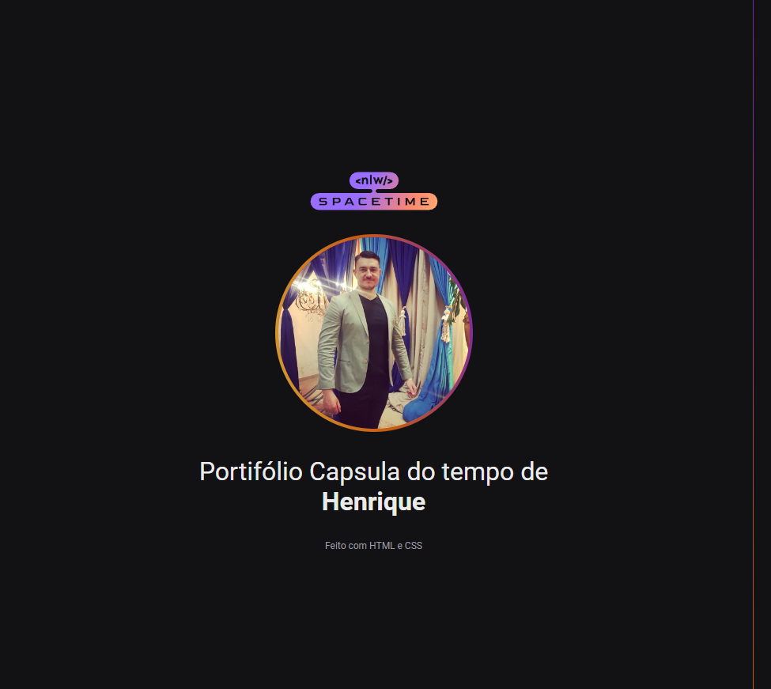

  

## Projeto 🖥️
O projeto é um projeto WEB RESPONSIVO de uma capsula do tempo de meu perfil, feito no evento NLW SPACETIME da Rocketseat

## Tecnologias utilizadas 🚀
- HTML
- CSS
- Git e Github

## Contato 📧
👤 Linkedin: [https://www.linkedin.com/in/henriquemateusheck/]
📧 Gmail: heckhenrique@gmail.com
📞 Whats: 51 985775578